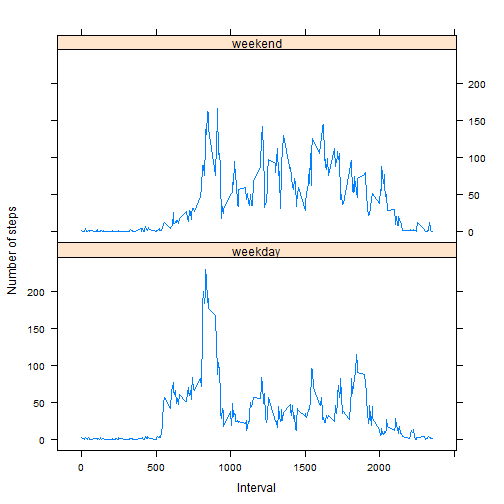

# Reproducible Research: Peer Assessment 1

## Loading and preprocessing the data


```r
setwd("C:/Users/u283407/OneDrive/Documents/Online Classes/Coursera/DataScience/ReproducibleResearch/PeerAssessment1/RepData_PeerAssessment1")

activity <- read.csv("activity.csv", sep = ",", header = TRUE)
```

## What is the mean total number of steps taken per day?

## 1. Calculate the total number of steps taken per day

```r
steps <- aggregate(steps ~ date, data=activity, FUN=sum)
stepsbyday <- steps$steps
```

## 2. Make a histogram of the total number of steps taken each day

```r
hist(stepsbyday)
```

 

## 3. Calculate and report the mean and median of the total number of steps taken per day

```r
mean(stepsbyday)
```

```
## [1] 10766.19
```

```r
median(stepsbyday)
```

```
## [1] 10765
```

## What is the average daily activity pattern?

## 1. Make a time series plot (i.e. type = "l") of the 5-minute interval (x-axis) and the average number of steps taken, averaged across all days (y-axis)


```r
avgsteps <- aggregate(steps ~ interval, data=activity, FUN=mean)
avgsteps$item <- seq(from = 1, to = 288, by = 1 )
plot(avgsteps$item, avgsteps$steps, type="l",
     xlab="5 Minute Intervals", ylab="Average # of Steps", main="Average Steps Across All Days")
```

 


## 2. Which 5-minute interval, on average across all the days in the dataset, contains the maximum number of steps?

```r
maxstep <- avgsteps[ which(avgsteps$steps==max(avgsteps$steps)), ]
maxstep$interval
```

```
## [1] 835
```


## Imputing missing values

## 1. Calculate and report the total number of missing values in the dataset (i.e. the total number of rows with NAs)

```r
length(which(is.na(activity$steps)))
```

```
## [1] 2304
```

## 2. Devise a strategy for filling in all of the missing values in the dataset. The strategy does not need to be sophisticated. For example, you could use the mean/median for that day, or the mean for that 5-minute interval, etc.

My strategy for imputing missing values is to use the mean for each 5-minute interval.

## 2a. Make a copy of the master data file

```r
activity2 <- activity
```

## 2b. Make and execute function that assigns the average steps by interval to the NA step values

```r
assignavginterval <- function(x=activity2) {

        i <- 0

        for (i in 1:nrow(x)) {

                ## Process records which have NA value in the steps column
                if (is.na(x$steps[i])) {
                
                        ## Assign the rounded average interval steps to the steps column
                        x$steps[i] <- round(avgsteps$steps[avgsteps$interval == x$interval[i]])
                
                }

        }
        ## Pass x out of function and assign it to activity2
        assign('activity2',x,envir=.GlobalEnv)
}
assignavginterval()
```

## 3. Calculate the total number of steps taken per day

```r
steps2 <- aggregate(steps ~ date, data=activity2, FUN=sum)
stepsbyday2 <- steps2$steps
```

## 4. Make a histogram of the total number of steps taken each day

```r
hist(stepsbyday2)
```

 

## 5. Calculate and report the mean and median of the total number of steps taken per day

```r
mean(stepsbyday2)
```

```
## [1] 10765.64
```

```r
median(stepsbyday2)
```

```
## [1] 10762
```

## 6. Do these values differ from the estimates from the first part of the assignment? What is the impact of imputing missing data on the estimates of the total daily number of steps?
Yes they differ. The 10,000-15,000 steps by day range of the imputed values increased by about 5 units over the original data.


## Are there differences in activity patterns between weekdays and weekends?
## 1. Add "DayofWk" column to Activity2 data set


```r
activity2$dayofwk <- as.character("DayofWk")
```


## 2. Make and execute function that assigns "weekday" or "weekend" to each observation

```r
dayofwk <- function(x=activity2){

        i <- 0

        for (i in 1:nrow(x)) {

 
                if ((as.character(weekdays(as.Date(x$date[i]))) == "Saturday") |
                    (as.character(weekdays(as.Date(x$date[i]))) == "Sunday")) {
                     

                        x$dayofwk[i] <- as.character("weekend")

                
                }
                else { 
                        
                        x$dayofwk[i] <- as.character("weekday")
                
                }
        }

        ## Pass x out of function and assign it to activity2
        assign('activity2',x,envir=.GlobalEnv)

}

dayofwk()
activity2$dayofwk <- as.factor(activity2$dayofwk)
```


## 3. Prepare "weekday" and "weekend" data for plotting

```r
activity2weekend <- activity2[ which(activity2$dayofwk == "weekend"), ]
activity2weekday <- activity2[ which(activity2$dayofwk == "weekday"), ]

avgstepsbyweekend <- aggregate(activity2weekend$steps ~ activity2weekend$interval, data=activity2weekend, FUN=mean)

colnames(avgstepsbyweekend) <- c("interval", "steps")
avgstepsbyweekend[, "dayofwk"] <- "weekend"


avgstepsbyweekday <- aggregate(activity2weekday$steps ~ activity2weekday$interval, data=activity2weekday, FUN=mean)

colnames(avgstepsbyweekday) <- c("interval", "steps")
avgstepsbyweekday[, "dayofwk"] <- "weekday"

avgsteps <- rbind(avgstepsbyweekend, avgstepsbyweekday)
avgsteps <- avgsteps[order(avgsteps$dayofwk, avgsteps$interval),]
```


## 4. Generate time series plot of the 5-minute interval (x-axis) and the average number of steps taken, averaged across all weekday days or weekend days (y-axis.)

```r
library(lattice)

xyplot((steps ~ interval|dayofwk),
           data = avgsteps,
           type = "l",
           panel = lattice.getOption("panel.xyplot"),
           xlab = "Interval",
           ylab = "Number of steps",
           layout=c(1,2))
```

 
     
     
